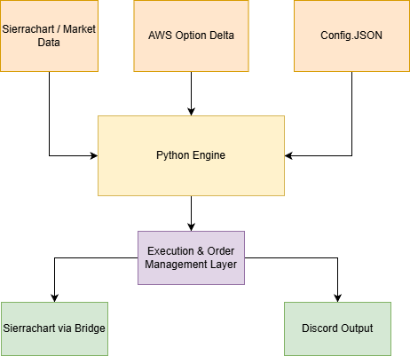
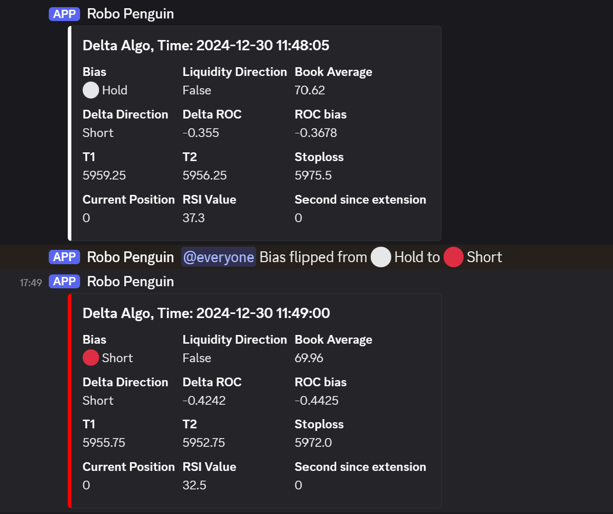
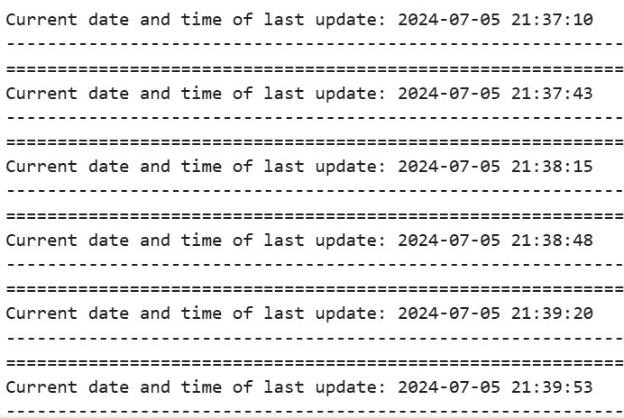
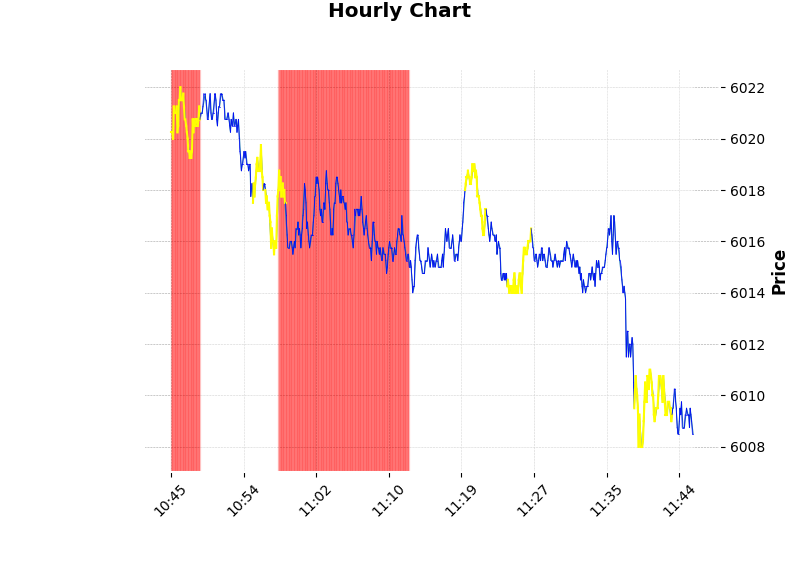
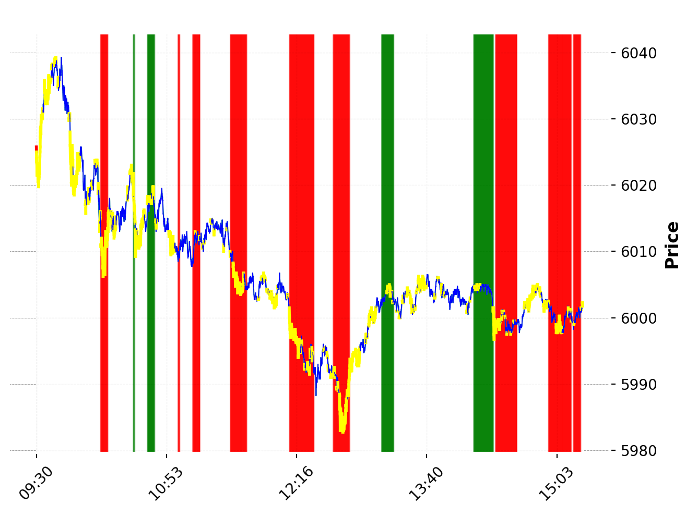

# Automated-Liquidity-Engine
A Python-based live trading engine that processes market data from Sierra Chart, combines it with real-time option delta signals from AWS, and generates automated execution decisions.
The system also includes visualization, Discord notifications, and modular Sierra Chart studies written in ASCIL (Derrivative of C++).

## System Architecture
The system combines multiple real-time data sources, processing them through the Python Engine, and routing trading decisions to Sierra Chart via a bridge while outputting analytics to Discord as shown in the picture below.

### How It Works (High-Level)
1. Market data arrives from Sierra Chart.
2. Option delta values are downloaded from AWS.
3. The Python Engine processes both streams:
  - builds liquidity zones
  - detects reactions
  - calculates directional bias
  - determines valid trade entries/exits
4. The Execution Layer sends trade actions to Sierra Chart.
5. Discord Output provides live signals and summary messages.

## Example outputs
### This picture shows the minutely update from the engine into a discord webhook showing the  flipping of bias:

### This picture shows the output that is generated everytime the engine does a full run so I could track how fast it was calculating: (note 5 second sleep timer)

### This picture shows the chart that is posted to discord every hour

### This picture shows a chart of a full day of signals

## Documentation
- [Engine Documentation](liquidity_engine/README.md)
- [Sierra Chart Studies](sierrachart/README.md)
